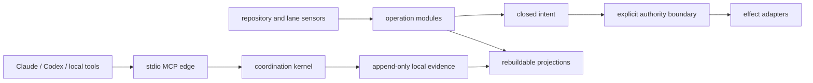

# Gaia Architecture

This is Gaia's authoritative architecture map. It owns system-level boundaries,
dependency direction, authority, state classes, and runtime topology. A linked subsystem
document remains authoritative for that subsystem's local mechanics. If the two conflict,
this map wins for the system boundary and the subsystem document wins inside its named seam.

## Purpose, scope, and non-goals

Gaia coordinates evidence-bearing software delivery. Its kernel preserves identities,
claims, observations, transitions, authority limits, and receipts so another actor can
replay or refuse a result. Replaceable adapters observe tools and repositories, persist
state, project operator views, and perform separately authorized effects.

This map describes behavior implemented in this repository at the verified revision. It
does not make a design document, prototype, research result, or provider capability part of
the kernel. Gaia is not a general-purpose operating system, an authentication service, a
distributed consensus system, a safety controller, a hosted multi-tenant service, or a
source of merge, deployment, spending, credential, or configuration authority.

## System context and organization-neutral boundary

The organization-neutral core speaks in work identities, generations, observations,
intents, effects, revisions, and receipts. Repository owners, account identifiers, API
payloads, client configuration, ref layouts, database tables, and filesystem locations
belong to adapters. An adapter may narrow capability; it cannot reinterpret identity,
freshness, uncertainty, terminal state, or authority.

Organization policy is injected at a composition root. No organization name, provider,
storage engine, or operator UI is needed to execute the pure state transitions.

## Components and dependency direction

Dependencies point inward:

1. pure state machines and closed policy vocabularies depend only on supplied values;
2. deep operation modules own identity, validation, sequencing, reconciliation, and
   terminal projection;
3. durable and effect adapters implement those modules' narrow seams;
4. scripts, MCP, workflows, and dashboards are composition roots and user-facing edges.

The pure kernel never imports a provider, process environment, clock, filesystem, network,
or UI. Edges inject observations and time. Effect adapters consume an already closed intent;
they do not create authority or revise the domain decision. Read models consume reconciled
evidence and never feed display state back into an effect decision.

## Module and seam map

The interface column is the caller-visible contract. Adapter-specific mechanics are named
only in the final column and must not escape in a result or refusal.

| Module | Interface | Seam | Concrete adapters |
| --- | --- | --- | --- |
| Coordination kernel | `decide(state, command) -> events`; `apply(state, event) -> state` | Six coordination verbs and replay | stdio MCP edge; deterministic tests |
| Durable event log | `load() -> events`; `commit(expected revision, events) -> receipt or refusal` | Single-writer append and compare-and-set | local append-only JSONL; in-memory test fixtures |
| Draft operation | `enqueue(selector)`; `reconcile(identity, expected revision) -> projection or refusal` | One canonical Operation Envelope | protected GitHub Git Data ledger and effect adapter; memory ledger |
| Hosted Draft intake | `runHostedDraftIntake(trigger, observations) -> receipt or refusal`; `produceHostedDraftPumpObservation(receipt) -> observation or refusal` | Bounded unsettled recovery before admitting at most one candidate; unchanged ambiguous records are quarantined for the scheduled tick without being settled; authority-free sealed observation | GitHub Actions intake, one recovery group plus one group per labeled issue; existing Draft ledger/admission/effect adapters; deterministic fixtures |
| Portfolio survey and drain | `survey(observations) -> revision`; `advance(revision) -> intent or refusal` | Read-only inventory to one bounded next transition | GitHub read adapter; deterministic fixtures; append-only drain ledger |
| Drain Petri net | `buildNet(definition) -> net`; `replay(net, events) -> run`; `collectDrainFacts(input) -> facts or refusal` | Bounded pull-request drain and lane lifecycle with exact-source evidence | JSONL artifact adapter; optional DuckDB read projection; read-only CLI |
| Pull-request conflict classification | `classifyPrConflict(observation, claim) -> reading or refusal` | Exact-generation, read-only classification under a closed empty strategy registry | normalized GitHub observation; deterministic fixtures |
| Runner capability probe | `probe(mandate, lease, adapter) -> receipt or blocker` | Read-only capability question decided by identity, generation, lease, admission and reconciliation before any adapter is consulted | synthetic-fixture probe; deterministic in-memory fixtures |
| Publication and operator | `prepare(intent)`; `authorize(grant)`; `execute(intent) -> receipt` | Human-mediated privileged effect | GitHub publication/operator adapters; owned in-memory broker tests |
| Factory telemetry | `record(phase)`; `replay(events) -> lifecycle or refusal` | Closed evidence events and freshness projection | local evidence log; wmux/Claude sensor; deterministic fixtures |
| Lane generation bootstrap | `bootstrapLaneGeneration(manifest, ports) -> receipt or refusal`; `verifyLaneLaunchReceipt(receipt) -> receipt or refusal` | Topology before spawn, verified launch receipt, and recoverable CAS cleanup intent; overlapping same-actor resumption is a known review blocker | deterministic in-memory generation store; deterministic lane-adapter fixture |
| Control room | `render(snapshot, observed instant) -> read model` | Authority-free operator projection | static HTML/dashboard; in-memory snapshots |
| Hybrid search | `index(corpus)`; `query(request) -> matches or refusal` | Advisory retrieval with provenance | local JavaScript engine; optional IX embedding input |
| Architecture drift | `checkArchitectureDrift(inventory) -> report or refusal` | Normalized repository inventory | filesystem inventory; deterministic in-memory inventory |
| Managed PR delivery rounds | `createInitialManagedRound(input) -> round or refusal`; `executeManagedRoundUpdate(input) -> receipt or blocker` | One evidence-bound managed-section transition with read-after-write proof | GitHub pull-request body CAS and conditional-write adapter; memory evidence and effect adapters |

The architecture-drift verification seam is the only seam introduced by this map itself. One
black-box contract suite runs against both adapters and includes broken-link, missing-section, stale
revision, interface-leak, change-impact, malformed-input, ordering, deletion-depth, and
mechanism-revert controls. Backtick code spans in the Interface column are the structurally
declared machine contract. The gate splits identifiers at punctuation, snake/kebab separators,
lower-to-upper transitions, and acronym-to-word transitions, then compares complete normalized
tokens with a closed adapter/mechanism vocabulary. Provider, configuration, transport-error,
storage-layout, payload, retry, path, ref, and object-identifier tokens in those spans fail the
gate; Git object forms such as commit-plus-SHA/hash and object-plus-ID are closed combinations.
Domain words that merely contain one of those character sequences remain valid. Unstructured prose
is not treated as proof of either a leak or a clean boundary.
Removing this module would force the workflow, local verifier, and tests to reimplement link
resolution, required-section policy, revision freshness, path sensitivity, closed reporting,
and interface-boundary checks. A black-box deletion control substitutes a shallow pass-through at
the same public seam and demonstrates that broken-link, missing-section, stale-revision,
interface-leak, and undeclared-impact mutants escape unless the caller reimplements those policies;
the unmodified caller also refuses when the seam is absent. The other module contracts and deletion
rationale are maintained in their linked subsystem designs and tests.

## Work lifecycle: pumps, funnels, and lanes

A pump is one bounded pass: observe sensors, replay durable state, select at most one eligible
transition, produce a closed intent, spend only the named authority, and append a receipt or an
explicit no-op. A funnel is the narrowing of many observations through readiness, policy,
capacity, and freshness gates to that one candidate; Gaia does not implement a generic funnel
framework. The portfolio drain and hosted Draft pump are the current concrete funnels.

A lane is an execution surface, not authority and not proof of useful work. Local wmux lanes are
observed by a read-only sensor. Four live lanes per workspace is the supported default; six is a
future validation target and limits above four are experimental. Lane heartbeats establish only
sensor freshness. They do not enter backlog truth, acceptance, completion, cost, percentage, or
ETA.

One declared generation of lanes is bootstrapped from an authoritative content-addressed manifest.
Identity is derived from that document rather than from a remembered pane, the complete empty
topology exists before any process, and a lane is never `ACTIVE` until a durable launch receipt is
published against one fresh structured observation. A refused launch compensates only the
resources its own operation created. Cleanup persists `COMPENSATING` before effects, blocks
successor generations while unresolved, and becomes `COMPENSATED` only after observed removal.
Same-actor overlapping resumptions remain a known review blocker: CAS on the record does not
fence every provider effect. No cross-host concurrency safety is claimed for this candidate. The
shipped adapters behind that seam are deterministic fixtures; a durable record store and a real
terminal host remain planned.

The principal operation lifecycle is observation -> eligible claim -> intent -> effect started ->
reconciliation -> terminal receipt. Draft operations preserve `ENQUEUED`, `CLAIMED`, `INTENT`,
`EFFECT_STARTED`, and `EFFECT_AMBIGUOUS` as nonterminal distinctions. `CREATED`, `REUSED`,
`REFUSED`, and `CANCELLED` are terminal only when exact evidence supports them. Ambiguous remote
effects remain nonterminal until reconciled; elapsed time and retries cannot manufacture truth.
The Hosted Draft intake is one concrete pump. An issue-triggered run remains bound to its issue and
fails closed on its unsettled operation. A scheduled run probes a bounded, deterministic prefix of
the unsettled queue before it may admit one eligible issue. When reconciliation returns the same
`EFFECT_AMBIGUOUS` result at the exact committed revision, the run performed no new effect and
quarantines that record for this tick so a poison message cannot block every later message. A
changed revision or any other result stops the tick for observation. Quarantine never settles,
deletes, or rewrites the durable operation. Scheduled recovery runs in one serialized group;
issue-triggered runs are partitioned per issue and may execute concurrently. Only the recovery group
publishes the sealed observation, and its unsettled count is read again after the run acts so that
work a concurrent lane committed meanwhile is counted. That observation is a read model with no
authority and cannot replace the durable Draft receipt chain.

Pull-request conflict classification is read-only at this revision. It binds the observed base and
head generation and can report clean, unknown, superseded, or escalation-required. Its automation
strategy registry is empty, so automatic resolution, durable conflict claims, patching, pushing,
and reconciliation remain explicitly planned rather than implied by the reserved lifecycle words.

Runner capability probing is read-only at this revision and is not a lane, a scheduler, or a grant.
A probe answers one question — may this execution surface be asked about this capability, at this
runner generation, under this lease — and returns one content-addressed receipt whose effect and
authority are `NONE` on every path, including the successful one. Its admission table narrows and
never grants: writing and merge-approval capabilities are representable exactly so that every
execution surface is refused them by one shared mechanism rather than by omission, and a surface
whose security gates have not passed carries an empty row rather than a missing one. Registration
labels are derived from the runner identity, never supplied. Every published receipt names whether
its reading came from a synthetic fixture or from a live provider, taken from the adapter's own
declaration rather than from the answer it returned, so evidence stays distinguishable by origin at
rest. The one operator-supplied identifier a receipt may carry is bounded to a short lowercase
label, so credential-shaped material has no admitted representation to travel in. A prior receipt
supplied for crash reconciliation is parsed against that same receipt contract and bound to the
runner, generation, provider, capability and mandate it claims before it is republished, so the
reconciliation path admits nothing the minting path could not have published. Runner bootstrap,
registration, mandate execution, drain, removal, durable receipts, and the rebuildable throughput
projection remain design only; the reserved vocabulary implies none of them. See
[the self-hosted runner capability probe](docs/self-hosted-runner-provider-probe.md).

## Authority and state transitions

Gaia keeps these concepts separate:

- a **claim** reserves or reports observed work and grants no effect authority;
- an **intent** is the exact proposed mutation bound to identity, generation, policy, and revision;
- an **effect** is attempted only by one named owner with one bounded capability;
- a **receipt** records preconditions, outcome, evidence revision, and authority actually spent;
- compare-and-set (CAS) rejects a transition when durable state moved after observation.

The coordination bus has exactly six non-privileged verbs: `register`, `send`, `inbox`, `ack`,
`heartbeat`, and `handoff`. Delivery means accepted for delivery, acknowledgement means receipt,
and handoff transfers context rather than privilege. Message text is `untrusted-text`. None of the
six verbs can approve, merge, push, commit, deploy, execute arbitrary code, read credentials,
change configuration, spend money, or grant authority.

State-changing operation modules have one boundary owner. Stable Work Identity is separate from
Generation Identity. Expected durable revisions gate adoption and mutation. Provider outcomes are
projected through closed vocabularies, and repeated delivery is idempotent or returns the prior
receipt without duplicating an effect.

## Durable and rebuildable state

GitHub Cloud is the durable authority for hosted repository facts, protected ledger refs,
published issues and pull requests, checks, and provider-observed effects. The canonical Draft
ledger uses append-only commits and non-force ref updates; Git object identifiers remain private
to its adapter while content revisions cross the module seam.

The local bus `events.jsonl`, portfolio drain ledger, and factory telemetry log are also durable
sources within one local data directory. They use a lock-directory protocol, validating replay,
newline-complete appends, fsync, and CAS. They are not substitutes for GitHub's hosted effect
truth and are not safe on a shared network filesystem.

Control-room snapshots, HTML, indexes, caches, and DuckDB PR-review telemetry are rebuildable
projections. Their absence or corruption cannot be treated as loss of hosted authority. DuckDB is
optional and never decides acceptance, readiness, or an effect. A projection may accelerate or
explain observation; it may not become a second writer of canonical state.

The drain Petri-net core and fact collector are pure replay modules. Their CLI composes JSONL and
artifact observations at the edge, and their optional DuckDB adapter rebuilds analytical tables
from the same deterministic run. Neither the CLI nor the projection may fire a transition or turn
an observation, actor kind, completion marker, or elapsed time into authority.

Durable bus records are ordered by their causal instant and retain append order when instants tie;
canonical content never reorders same-instant events. Each edge fact may fire once during the
stable evolution of its event, remains available until consumed, then expires before the next
event. DuckDB records ordinal `-1` as the initial marking, including nets with no fact event,
without inventing an instant.

## Providers and offline artifacts

Provider adapters translate a closed intent into a concrete effect and normalize the observation
back into the module vocabulary. Provider identifiers, payloads, diagnostics, retry state,
configuration, credentials, refs, object identifiers, and storage paths stay behind that seam.
Transport ambiguity is normalized as an unsettled observation, not a success or refusal guessed
from prose.

Offline adapters are advisory. The local hybrid-search path accepts caller-supplied embeddings or
an optional local IX embedding binary and preserves URI, line, digest, and freshness provenance.
Its result is `RETRIEVAL_MATCH` with `authority: NONE`. The enforced ecosystem policy currently
allows read-only GA and runtime-only TARS adapters, rejects Hari integration, and defers IX runtime
coupling. Those verdicts do not widen the six bus verbs.

## Failure, restart, replay, reconciliation, and alerts

Gaia fails closed. A lock timeout, torn or corrupt log, invalid chain, stale CAS revision,
unsupported record, incomplete provider observation, or identity mismatch writes no reassuring
partial result. The local bus restarts by validating and replaying the complete append-only log.
A stuck lock is reported and requires a human to establish that its owner is gone; code never
auto-breaks it. A damaged log is preserved for diagnosis and is never silently truncated.

Hosted operations reload their sealed envelope and durable receipt chain. Reconciliation reads
the authoritative provider again and either proves the exact terminal state or remains unsettled.
Each scheduled Hosted Draft intake first lists and probes a bounded deterministic prefix of
unsettled operations. A terminal result, changed revision, or newly observed state stops the run; an
unchanged ambiguous result is recorded as a per-tick quarantine and the next message is tried. Only
when every probed record was unchanged and ambiguous may that run continue to candidate admission.
A crash after enqueue therefore leaves durable work for the next intake, while a lost
compare-and-set performs no effect and is reported as a typed stale-revision refusal.
Retries repeat a bounded request under the same identity and idempotency boundary; they do not
skip revision checks. Repeated independently reproduced failures at one seam trip the
Boundary redesign circuit breaker and preserve immutable Failure Evidence.

Alerts are evidence-backed projections: blockers, expired telemetry, corrupt evidence, stale
reviews, and authority-needed states. A missing sensor yields unknown or paused state, never a
fabricated failure or success. Detailed recovery procedures remain in
[Crash recovery](docs/crash-recovery.md).

## Security, tenancy, quotas, and human approvals

The bus provides authority confinement, not authentication. Actor trust is positional: a process
able to spawn the server can register and speak as an actor. One data directory is one local trust
and failure boundary; Gaia does not claim hosted tenant isolation, cross-tenant confidentiality,
or service-level availability.

Least privilege is structural: the bus lacks privileged verbs, adapters receive bounded inputs,
provider secrets are excluded from evidence, and irreversible actions are separate transitions.
The hosted operator requires an interactive human to confirm the full revision-bound intent and
spends a short-lived grant once. Non-interactive input cannot authorize it. Publication, merge,
deployment, spending, credential, and configuration rights are never inferred from agent text,
labels, activity, or completion markers.

Resource ceilings are local safeguards, not billing authority: four supported live lanes,
bounded outputs, timeouts, one-step drain transitions, and explicit cost/fanout limits where a
factory request declares them. Gaia has no general quota service and no authority to start paid
work merely because capacity appears available. Production multi-tenancy, billing quotas, and a
remote authority broker are not implemented.

## Observability, provenance, freshness, ETA, and delivery metrics

Every decision-bearing artifact binds stable identities, content revisions, producer/method
context, and derivation links. Raw agent output is untrusted evidence and never becomes an
architecture claim without a source witness. Freshness, quality, acceptance, and authority are
independent axes.

The telemetry spine records a closed seven-event lifecycle with no prompt, reasoning, output,
credential, or free-text field. Replay is deterministic. An observer supplies its own instant and
applies the 30-second heartbeat window. A fresh heartbeat proves liveness of that sensor only; a
stale heartbeat produces an explicit blocker and cannot animate the control room.

The control room reports queue and lifecycle counts, terminal outcomes, blockers, evidence age,
last verified transition, and the next evidence checkpoint. It does not invent project-completion
percentages, throughput, confidence, or an ETA for open-ended work. Provider progress may show
elapsed time and a remaining timeout upper bound labelled `(not an ETA)`. Delivery metrics measure
accepted transitions and receipts, not tokens, lane activity, or prose completion markers.

## Runtime topology and operating modes

- **Local plugin candidate:** Node.js over stdio MCP, append-only local state, no listener, no
  remote execution, and no shell transport. Windows with Node 20 and 24 is the supported CI path;
  Ubuntu remains portability discovery.
- **Local factory/operator:** bounded Claude/Codex/wmux processes, offline artifacts, explicit
  worktrees, read-only dashboards, and an interactive authority boundary for privileged effects.
- **Hosted pump:** GitHub Actions runs the scheduled Draft intake in one serialized recovery group
  and issue-triggered intake partitioned per issue, plus
  the separately sealed effect path. Protected Git refs are the durable ingress/receipt ledger;
  Actions is not the queue or authority source.
- **Read-only/offline analysis:** portfolio survey, hybrid search, telemetry replay, architecture
  verification, and control-room rendering run with `effect: NONE`.

This repository is an installation candidate, not an installed plugin. Automatic pull-request
conflict resolution and its effect lifecycle, remote operator authority beyond the shipped
interactive path, and six-lane validation remain planned; production tenant/quota services are out
of scope. Planned work stays non-normative until code, evidence, and a fresh verification revision
are linked here.

## Detailed architecture references

- [Engineering and research principles](docs/engineering-and-research-principles.md) — normative
  module, authority, tracer, evidence, and redesign constraints.
- [Canonical Draft operation envelope](docs/draft-operation-envelope.md) and
  [ADR 0001](docs/adr/0001-canonical-operation-envelope.md) — identity, ledger, CAS, effect, and
  reconciliation ownership.
- [Hosted Draft intake](docs/hosted-draft-intake.md) and
  [Hosted Draft observation producer](docs/hosted-draft-pump-producer.md) — scheduled admission,
  bounded recovery with poison-message quarantine, receipt-derived observation, and authority
  boundaries.
- [Portfolio factory](docs/github-portfolio-factory.md),
  [portfolio drain pump](docs/portfolio-drain-pump.md), and
  [hosted operator](docs/github-portfolio-operator.md) — observation, funnel, intent, and approval.
- [Factory telemetry spine](docs/factory-telemetry-spine.md) and
  [control room](docs/factory-control-room.md) — lifecycle evidence, freshness, and projections.
- [Scale and lanes](docs/scale-and-lanes.md) and
  [local wmux lanes](docs/local-wmux-lanes.md) — measured concurrency and lane semantics.
- [Lane generation bootstrap](docs/lane-generation-bootstrap.md) — manifest-derived generation
  identity, topology-before-spawn ordering, the launch receipt as linearization point, and exact
  compensation.
- [Ecosystem adapters](docs/ecosystem-adapters.md) and
  [hybrid semantic search](docs/hybrid-semantic-search.md) — bounded external and offline inputs.
- [Pull-request conflict classifier](docs/pr-conflict-reconciler.md) — exact-generation read-only
  classification and the deliberately empty automation registry.
- [Managed PR delivery rounds](docs/pr-delivery-round-history.md) — bounded R0/R1 history,
  single-owner conditional effect, durable intent, and read-after-write reconciliation.
- [Crash recovery](docs/crash-recovery.md),
  [artifact completion signals](docs/artifact-completion-signals.md), and
  [holdout-safe reporting](docs/holdout-safe-reporting.md) — recovery, terminal evidence, and
  provenance discipline.

## Verification

The authoritative machine-readable `Last verified at` record is
`package.json#gaiaArchitectureVerification`. It binds a verification date and reviewed Git commit
to the SHA-256 revision of the exact `ARCHITECTURE.md` bytes. The named commit must contain those
same bytes and the behavior this map marks implemented; a design-only commit is not a final
attestation merely because its tree contains the prose. Keeping the attestation outside this file
avoids a self-referential content hash while leaving this map byte-stable after review. The record
is therefore written only after the behavior-bearing commit exists and names that commit. That
commit is provenance for readers: a squash merge leaves it naming a commit of the merged head
branch, which main does not contain and a clone need not hold, so the gate never resolves it.

Verification inspects the root README, the pure coordination kernel, append-only event log,
operation envelope, portfolio/drain, telemetry/control-room, lane, ecosystem, recovery, security,
and runtime contracts at the attested commit. `npm run architecture:verify` checks this document's
required sections, internal links, exact content revision, declared interface contracts, and
architecture-sensitive change declaration. The content check is the attestation: the record's
`contentRevision` must equal the SHA-256 of the `ARCHITECTURE.md` bytes in the checked tree, so an
edit without re-attestation fails as `ARCHITECTURE_CONTENT_REVISION_MISMATCH` in every clone, and a
record copied from another tree passes only when that tree's bytes are identical. The record's
`commit` must be a full lowercase commit identifier (`VERIFICATION_RECORD_INVALID` otherwise) and is
not resolved, so the verdict does not depend on which branch refs a clone has fetched. Callers
cannot inject revision evidence; the CLI reads the tree and `git diff` for changed paths only. An
explicit base is limited to a full commit identifier or canonical
`refs/heads/`, `refs/tags/`, or `refs/remotes/` name and is passed after Git's
`--end-of-options` delimiter. Detailed subsystem claims remain owned by the linked documents and
their black-box tests. The CI architecture-impact gate is intentionally pull-request-only because
its declaration and evidence are PR-body facts. Main-push CI still runs the supported test matrix;
it does not reconstruct or invent impact evidence after merge.
