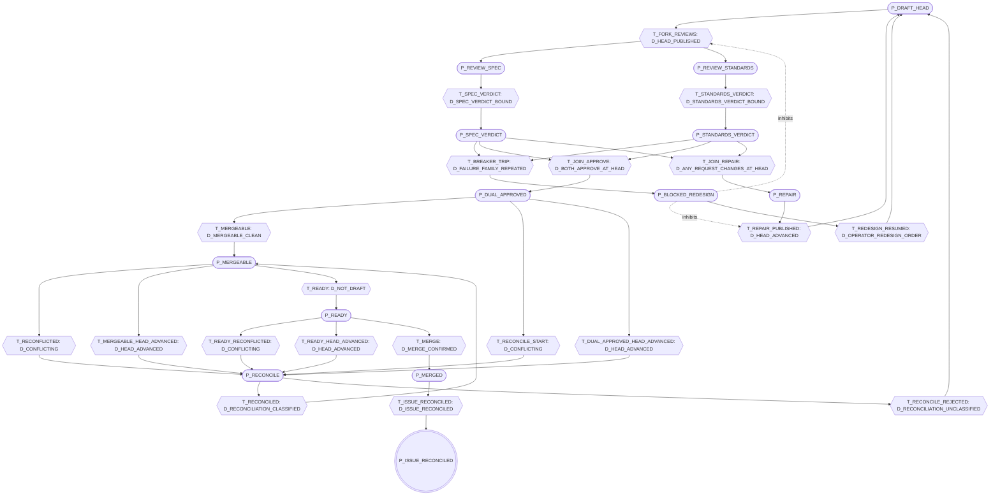

# Drain chart and agent bindings

Status: #102, slice W9 of the R2 drain design
(`gaia-architect-r2-grafcet-drain-design.md:86-106`, `gaia-architect-r2-grafcet-drain-design.md:555-575`).
This document carries the pull-request drain chart that `src/drain-petri-net.mjs` interprets,
rendered from `DRAIN_NET_TEMPLATE` (shipped by #112 for #100), and binds the three drain agents
under `.claude/agents/` to it. It uses the shipped ids (`P_*` steps, `D_*` receptivities, `T_*`
transitions) and draws no second chart: the design's R1 to R15 were the proposal the shipped
receptivities replaced. Nothing in `src/` or `scripts/` changes.

## Why the agents are bound to the chart

The agents' rules were measured on the fleet and written as prose (`docs/github-drain-agents.md`).
The chart was written later as data that a deterministic interpreter evolves. Until this slice,
nothing tied the two: an agent could refuse on a fact the chart does not name, or the chart could
wait on a fact no agent reads. The R2 design lists the gaps this exposed: five transitions the
fleet took on facts it read but never named (`gaia-architect-r2-grafcet-drain-design.md:572-575`),
an issue close that trusts the merge commit an order states
(`gaia-architect-r2-grafcet-drain-design.md:570-571`), and pull-request body keywords that close
issues no order named (`gaia-architect-r2-grafcet-drain-design.md:555-559`).

## How to read the chart

- A **step** (`P_*`) holds the pull request while an actor works inside it. The agents are those
  actors: a reviewer runs inside `P_REVIEW_SPEC` or `P_REVIEW_STANDARDS`; the publisher's ordered
  commands run inside `P_MERGEABLE` (`ready`), `P_READY` (`merge`), and `P_MERGED`
  (`issue-close`).
- A **receptivity** (`D_*`) is a fact a collector measured from the bus log and the artifact
  bytes, `true`, `false`, or `UNKNOWN`. `UNKNOWN` never fires. An `EDGE` receptivity holds for the
  one observation that changed it; a `LEVEL` one holds while the latest observation says so.
- A **transition** (`T_*`) fires when its input places hold their weights, no inhibitor place
  holds a token, and its receptivity is `true`. When it cannot, the chart reports the
  transition's refusal. Transitions enabled on one marking fire together; when two compete for
  the same tokens, the higher priority wins.
- A **shared resource** (`MERGE_LOCK`, `PROVIDER_CAPACITY`) is a place many pull requests compete
  for. `MERGE_LOCK` is the publication token: `T_MERGEABLE`, `T_RECONCILE_START`, and
  `T_DUAL_APPROVED_HEAD_ADVANCED` take it, `T_MERGE` and `T_RECONCILE_REJECTED` return it.

An agent never fires a transition. The collector evaluates every receptivity from the bus log and
the artifact bytes; an agent reads the GitHub fields and artifact bytes behind them, and a refusal
it returns names the chart ids it reads: the receptivities whose facts it measured false, the
steps whose work it guards, or the resource it found held.

## Chart

<!-- BEGIN chart: rendered from DRAIN_NET_TEMPLATE by tests/drain-grafcet.test.mjs; edit the template, not this block -->
Net `gaia.drain-petri-net.pr-drain`, template revision `sha256:8fbd865b6330f5d4c8343b8e5755fc1ce463e8868d097a45c8a4d870bc034184`.

### Places

| Place | Kind | Initial / capacity | Meaning |
| --- | --- | --- | --- |
| `MERGE_LOCK` | shared resource | 1 / 1 | one reconciliation-and-merge at a time (B35) |
| `PROVIDER_CAPACITY` | shared resource | 4 / 4 | live lanes the provider may run |
| `P_DRAFT_HEAD` | step | 1 / 1 | draft head published |
| `P_REVIEW_SPEC` | step | 0 / 1 | Spec review running at the head |
| `P_REVIEW_STANDARDS` | step | 0 / 1 | Standards review running at the head |
| `P_SPEC_VERDICT` | step | 0 / 1 | Spec verdict bound to the head |
| `P_STANDARDS_VERDICT` | step | 0 / 1 | Standards verdict bound to the head |
| `P_DUAL_APPROVED` | step | 0 / 1 | both axes APPROVE at the head |
| `P_REPAIR` | step | 0 / 1 | bounded repair running |
| `P_RECONCILE` | step | 0 / 1 | reconciliation onto main running |
| `P_MERGEABLE` | step | 0 / 1 | mergeable and clean, lock held |
| `P_READY` | step | 0 / 1 | ready for review (not a draft) |
| `P_MERGED` | step | 0 / 1 | merge confirmed |
| `P_ISSUE_RECONCILED` | step, terminal | 0 / 1 | linked issue reconciled |
| `P_BLOCKED_REDESIGN` | step | 0 / 1 | ENG-09 breaker tripped |

### Receptivities

| Receptivity | Kind | Fact | Channel |
| --- | --- | --- | --- |
| `D_HEAD_PUBLISHED` | LEVEL | the latest recorded observation of the pull request names a full head SHA | bus message.sent kind pr-observation (head=) |
| `D_SPEC_VERDICT_BOUND` | LEVEL | a Spec review artifact titled for this pull request states detached at the current head on its Subject line, carries exactly one verdict line, and ends with its marker | artifact bytes: title, Subject header, \*\*Verdict:\*\* line, last non-empty line |
| `D_STANDARDS_VERDICT_BOUND` | LEVEL | a Standards review artifact bound as above | artifact bytes: title, Subject header, \*\*Verdict:\*\* line, last non-empty line |
| `D_BOTH_APPROVE_AT_HEAD` | LEVEL | the bound Spec verdict and the bound Standards verdict are both APPROVE | artifact bytes, both axes |
| `D_ANY_REQUEST_CHANGES_AT_HEAD` | LEVEL | both axes are bound and at least one verdict is REQUEST_CHANGES | artifact bytes, both axes |
| `D_FAILURE_FAMILY_REPEATED` | LEVEL | two REQUEST_CHANGES artifacts of this pull request at distinct heads carry the same non-empty Family token | artifact bytes: Family: line |
| `D_HEAD_ADVANCED` | EDGE | a recorded observation names a head different from the previous one | bus message.sent kind pr-observation (head=) |
| `D_MERGEABLE_CLEAN` | LEVEL | the latest observation at the current head records mergeable=MERGEABLE | bus pr-observation (mergeable=) |
| `D_CONFLICTING` | LEVEL | the latest observation at the current head records mergeable=CONFLICTING | bus pr-observation (mergeable=) |
| `D_RECONCILIATION_CLASSIFIED` | EDGE | a changed-head observation records reconciliation=CLASSIFIED and checks=ALL_PASS while both review axes APPROVE artifacts bound to that exact head | bus pr-observation plus exact-head artifact bytes |
| `D_RECONCILIATION_UNCLASSIFIED` | EDGE | an observation records reconciliation=UNCLASSIFIED | bus pr-observation (reconciliation=) |
| `D_NOT_DRAFT` | LEVEL | the latest observation at the current head records draft=false | bus pr-observation (draft=) |
| `D_MERGE_CONFIRMED` | LEVEL | the latest observation records state=MERGED with a merge commit | bus pr-observation (state=, mergeCommit=) |
| `D_ISSUE_RECONCILED` | LEVEL | the latest observation records issue=none or issueState=CLOSED | bus pr-observation (issue=, issueState=) |
| `D_OPERATOR_REDESIGN_ORDER` | LEVEL | an operator order (class D) lifts the breaker | none in R0: class-D orders never travel on the bus |

### Transitions

| Transition | Consumes | Produces | Inhibited by | Receptivity | Refusal | Priority |
| --- | --- | --- | --- | --- | --- | --- |
| `T_FORK_REVIEWS` | `P_DRAFT_HEAD`, 2 × `PROVIDER_CAPACITY` | `P_REVIEW_SPEC`, `P_REVIEW_STANDARDS` | `P_BLOCKED_REDESIGN` | `D_HEAD_PUBLISHED` | `HEAD_UNOBSERVED` | 0 |
| `T_SPEC_VERDICT` | `P_REVIEW_SPEC` | `P_SPEC_VERDICT`, `PROVIDER_CAPACITY` | — | `D_SPEC_VERDICT_BOUND` | `SPEC_VERDICT_NOT_BOUND` | 0 |
| `T_STANDARDS_VERDICT` | `P_REVIEW_STANDARDS` | `P_STANDARDS_VERDICT`, `PROVIDER_CAPACITY` | — | `D_STANDARDS_VERDICT_BOUND` | `STANDARDS_VERDICT_NOT_BOUND` | 0 |
| `T_BREAKER_TRIP` | `P_SPEC_VERDICT`, `P_STANDARDS_VERDICT` | `P_BLOCKED_REDESIGN` | — | `D_FAILURE_FAMILY_REPEATED` | `FAMILY_NOT_REPEATED` | 1 |
| `T_JOIN_APPROVE` | `P_SPEC_VERDICT`, `P_STANDARDS_VERDICT` | `P_DUAL_APPROVED` | — | `D_BOTH_APPROVE_AT_HEAD` | `DUAL_APPROVAL_MISSING` | 0 |
| `T_JOIN_REPAIR` | `P_SPEC_VERDICT`, `P_STANDARDS_VERDICT`, `PROVIDER_CAPACITY` | `P_REPAIR` | — | `D_ANY_REQUEST_CHANGES_AT_HEAD` | `NO_REQUEST_CHANGES` | 0 |
| `T_REPAIR_PUBLISHED` | `P_REPAIR` | `P_DRAFT_HEAD`, `PROVIDER_CAPACITY` | `P_BLOCKED_REDESIGN` | `D_HEAD_ADVANCED` | `REPAIR_UNPUBLISHED` | 0 |
| `T_MERGEABLE` | `P_DUAL_APPROVED`, `MERGE_LOCK` | `P_MERGEABLE` | — | `D_MERGEABLE_CLEAN` | `NOT_MERGEABLE` | 0 |
| `T_RECONCILE_START` | `P_DUAL_APPROVED`, `MERGE_LOCK`, `PROVIDER_CAPACITY` | `P_RECONCILE` | — | `D_CONFLICTING` | `NOT_CONFLICTING` | 0 |
| `T_RECONFLICTED` | `P_MERGEABLE`, `PROVIDER_CAPACITY` | `P_RECONCILE` | — | `D_CONFLICTING` | `NOT_CONFLICTING` | 0 |
| `T_READY_RECONFLICTED` | `P_READY`, `PROVIDER_CAPACITY` | `P_RECONCILE` | — | `D_CONFLICTING` | `NOT_CONFLICTING` | 0 |
| `T_DUAL_APPROVED_HEAD_ADVANCED` | `P_DUAL_APPROVED`, `MERGE_LOCK`, `PROVIDER_CAPACITY` | `P_RECONCILE` | — | `D_HEAD_ADVANCED` | `HEAD_UNCHANGED` | 2 |
| `T_MERGEABLE_HEAD_ADVANCED` | `P_MERGEABLE`, `PROVIDER_CAPACITY` | `P_RECONCILE` | — | `D_HEAD_ADVANCED` | `HEAD_UNCHANGED` | 2 |
| `T_READY_HEAD_ADVANCED` | `P_READY`, `PROVIDER_CAPACITY` | `P_RECONCILE` | — | `D_HEAD_ADVANCED` | `HEAD_UNCHANGED` | 2 |
| `T_RECONCILED` | `P_RECONCILE` | `P_MERGEABLE`, `PROVIDER_CAPACITY` | — | `D_RECONCILIATION_CLASSIFIED` | `RECONCILIATION_UNCLASSIFIED` | 0 |
| `T_RECONCILE_REJECTED` | `P_RECONCILE` | `P_DRAFT_HEAD`, `MERGE_LOCK`, `PROVIDER_CAPACITY` | — | `D_RECONCILIATION_UNCLASSIFIED` | `RECONCILIATION_NOT_REJECTED` | 0 |
| `T_READY` | `P_MERGEABLE` | `P_READY` | — | `D_NOT_DRAFT` | `STILL_DRAFT` | 0 |
| `T_MERGE` | `P_READY` | `P_MERGED`, `MERGE_LOCK` | — | `D_MERGE_CONFIRMED` | `MERGE_UNCONFIRMED` | 0 |
| `T_ISSUE_RECONCILED` | `P_MERGED` | `P_ISSUE_RECONCILED` | — | `D_ISSUE_RECONCILED` | `ISSUE_RECONCILIATION_PENDING` | 0 |
| `T_REDESIGN_RESUMED` | `P_BLOCKED_REDESIGN` | `P_DRAFT_HEAD` | — | `D_OPERATOR_REDESIGN_ORDER` | `REDESIGN_ORDER_ABSENT` | 0 |

### Chart

<!-- END chart -->

## Bindings

Each refusal or blocker an agent can return, the agents that return it, the chart ids it reads,
and the subject it is reported with. Where the chart refuses a transition with the same code, the
binding names that transition's receptivity.

| Refusal | Agents | Chart | Subject | Why |
| --- | --- | --- | --- | --- |
| `SUBJECT_MISSING` | reviewer | `P_REVIEW_SPEC`, `P_REVIEW_STANDARDS` | the `subject` path | the review is the work inside the step; no work tree, no verdict to bind |
| `SHA_NOT_FULL` | reviewer | `P_REVIEW_SPEC`, `P_REVIEW_STANDARDS` | the value given | the verdict binds to one full head SHA |
| `SUBJECT_COMMIT_MISMATCH` | reviewer | `P_REVIEW_SPEC`, `P_REVIEW_STANDARDS` | the commit `git rev-parse HEAD` read | the review would judge a head the step does not hold |
| `SUBJECT_NOT_DETACHED` | reviewer | `P_REVIEW_SPEC`, `P_REVIEW_STANDARDS` | the branch HEAD is on | a branch can move under the review |
| `SUBJECT_DIRTY` | reviewer | `P_REVIEW_SPEC`, `P_REVIEW_STANDARDS` | the first path `git status` lists | the bytes reviewed would not be the head's |
| `AXIS_INVALID` | reviewer | `P_REVIEW_SPEC`, `P_REVIEW_STANDARDS` | the axis given | each step is one axis |
| `BASE_UNREACHABLE` | reviewer | `P_REVIEW_SPEC`, `P_REVIEW_STANDARDS` | the `baseSha` given | the architecture gate pins the base |
| `ARTIFACT_UNNAMED` | reviewer | `P_REVIEW_SPEC`, `P_REVIEW_STANDARDS` | the input missing, `artifact` or `marker` | the verdict receptivities read the artifact and its marker |
| `PUBLICATION_BUSY` | coordinator | `MERGE_LOCK` | the pull request that holds the token | one `MERGE_LOCK` token covers every merge and reconciliation (B35) |
| `REPAIR_UNPUBLISHED` | coordinator | `D_HEAD_ADVANCED` | the repair's exit head | the chart's refusal for `T_REPAIR_PUBLISHED`: a repair counts once origin's head moves |
| `BLOCKED_REDESIGN` | coordinator | `D_FAILURE_FAMILY_REPEATED`, `P_BLOCKED_REDESIGN` | the family | `T_BREAKER_TRIP` outranks `T_JOIN_APPROVE` and `T_JOIN_REPAIR`, so it trips whatever the head's verdicts; the step inhibits new reviews and repairs (ENG-09). The coordinator waits on it before any class |
| `RECONCILIATION_UNCLASSIFIED` | coordinator, publisher | `D_RECONCILIATION_CLASSIFIED`, `D_RECONCILIATION_UNCLASSIFIED` | coordinator: the first unclassified commit; publisher: `#N` | the chart's refusal for `T_RECONCILED`; `T_RECONCILE_REJECTED` returns the head to review (see Divergences) |
| `ISSUE_RECONCILIATION_PENDING` | coordinator | `D_ISSUE_RECONCILED` | the issue `#M` | the chart's refusal for `T_ISSUE_RECONCILED` |
| `ORDER_DIGEST_MISMATCH` | publisher | `P_MERGEABLE`, `P_READY`, `P_MERGED` | the order path | the order is the operator's admission for the commands inside these steps: `ready`, `merge`, `issue-close`. No receptivity reads it |
| `ORDER_INCOMPLETE` | publisher | `P_MERGEABLE`, `P_READY`, `P_MERGED` | the order path | as above |
| `ARTIFACT_MISSING` | publisher | `D_SPEC_VERDICT_BOUND`, `D_STANDARDS_VERDICT_BOUND` | the artifact path | an unreadable artifact binds no axis |
| `AXIS_MISSING` | publisher | `D_SPEC_VERDICT_BOUND`, `D_STANDARDS_VERDICT_BOUND` | the artifact path | the axis is read from the title line |
| `SHA_NOT_BOUND` | publisher | `D_SPEC_VERDICT_BOUND`, `D_STANDARDS_VERDICT_BOUND` | the artifact path | a verdict binds to the head its `Subject:` line declares |
| `VERDICT_MISSING` | publisher | `D_BOTH_APPROVE_AT_HEAD` | the artifact path | both bound verdicts are `APPROVE` |
| `MARKER_MISSING` | publisher | `D_SPEC_VERDICT_BOUND`, `D_STANDARDS_VERDICT_BOUND` | the artifact path | a bound artifact ends with its marker |
| `CLOSING_EFFECT_UNNAMED` | publisher | `D_ISSUE_RECONCILED` | the first issue one list names and the other does not | the merge moves every issue in `closingIssuesReferences` toward `T_ISSUE_RECONCILED`; the order names them all |
| `PR_NOT_MERGED` | publisher | `D_MERGE_CONFIRMED` | `#N` | an issue close without a merge starts from `P_MERGED`, which only `D_MERGE_CONFIRMED` reaches |
| `HEAD_MISMATCH` | publisher | `D_HEAD_ADVANCED` | `#N` | a moved head preempts merge progress (the three `T_*_HEAD_ADVANCED`, priority 2) |
| `NOT_MERGEABLE` | coordinator, publisher | `D_MERGEABLE_CLEAN` | `#N` | the chart's refusal for `T_MERGEABLE`; the coordinator waits on it, the publisher refuses on it (see Divergences) |
| `CHECKS_NOT_GREEN` | coordinator, publisher | `D_NOT_DRAFT` | `#N` | the collector holds `D_NOT_DRAFT` only when checks read `ALL_PASS` |
| `ACTION_NOT_ORDERED` | publisher | `P_MERGEABLE`, `P_READY`, `P_MERGED` | the action asked | as the order checks |
| `STATE_CHANGED` | publisher | `D_HEAD_ADVANCED`, `D_ISSUE_RECONCILED` | `#N` | `HEAD_MISMATCH` and `CLOSING_EFFECT_UNNAMED`, re-read immediately before the merge command |
| `STILL_DRAFT` | publisher | `D_NOT_DRAFT` | `#N` | the chart's refusal for `T_READY`, read after `gh pr ready` |
| `MERGE_UNCONFIRMED` | publisher | `D_MERGE_CONFIRMED` | `#N` | the chart's refusal for `T_MERGE`, read after the merge command |
| `ISSUE_CLOSE_UNCONFIRMED` | publisher | `D_ISSUE_RECONCILED` | the issue `#M` | `T_ISSUE_RECONCILED` reads the issue closed, whether the order or the merge closed it |

## Chart refusals no agent returns

These say that a step has not ended yet. No agent returns them: the coordinator reads the same
receptivities as classes, below, and its lane for an unended step is the work inside it or
`wait`. Every refusal of the chart is either bound above or listed here, with the transitions that
refuse with it.

| Refusal | Transitions | Reading |
| --- | --- | --- |
| `HEAD_UNOBSERVED` | `T_FORK_REVIEWS` | no observation names a head yet |
| `SPEC_VERDICT_NOT_BOUND` | `T_SPEC_VERDICT` | the Spec review is running, or its artifact does not bind |
| `STANDARDS_VERDICT_NOT_BOUND` | `T_STANDARDS_VERDICT` | the same, for Standards |
| `FAMILY_NOT_REPEATED` | `T_BREAKER_TRIP` | the breaker holds |
| `DUAL_APPROVAL_MISSING` | `T_JOIN_APPROVE` | the two verdicts are not both `APPROVE` |
| `NO_REQUEST_CHANGES` | `T_JOIN_REPAIR` | no verdict requests changes |
| `NOT_CONFLICTING` | `T_RECONCILE_START`, `T_RECONFLICTED`, `T_READY_RECONFLICTED` | the head does not conflict |
| `HEAD_UNCHANGED` | `T_DUAL_APPROVED_HEAD_ADVANCED`, `T_MERGEABLE_HEAD_ADVANCED`, `T_READY_HEAD_ADVANCED` | the head has not moved |
| `RECONCILIATION_NOT_REJECTED` | `T_RECONCILE_REJECTED` | no unclassified reconciliation was observed |
| `REDESIGN_ORDER_ABSENT` | `T_REDESIGN_RESUMED` | no operator order lifts the breaker |

## Coordinator classes

The coordinator's six classes, each a predicate over the receptivities its step-4 bullet names. A
head is *approved* when `D_BOTH_APPROVE_AT_HEAD` holds or the head is `reconciled`: the
reconciliation class of the coordinator's step 3, which applies only while neither axis carries a
verdict on the head itself. Every head falls in exactly one class, by how many axes carry a verdict
on it and then, for an approved head, by its mergeability, so no precedence decides between them.
The test gates enumerate the states.

| Class | Predicate | Next lane |
| --- | --- | --- |
| `conflicting` | `D_BOTH_APPROVE_AT_HEAD` or `reconciled`, and `D_CONFLICTING` | `reconcile`: every way into `P_RECONCILE` starts from `P_DUAL_APPROVED`, `P_MERGEABLE`, or `P_READY`, steps reached only through `T_JOIN_APPROVE` |
| `changes-requested` | `D_ANY_REQUEST_CHANGES_AT_HEAD`: both axes bound, one `REQUEST_CHANGES` | `bounded repair` |
| `unreviewed` | `D_HEAD_PUBLISHED`, neither `D_SPEC_VERDICT_BOUND` nor `D_STANDARDS_VERDICT_BOUND`, and not `reconciled` | both review axes, as `T_FORK_REVIEWS` forks them |
| `single-axis` | exactly one of `D_SPEC_VERDICT_BOUND` and `D_STANDARDS_VERDICT_BOUND` | the missing axis; the chart joins only when both are bound |
| `dual-approved` | `D_BOTH_APPROVE_AT_HEAD` or `reconciled`, and neither `conflicting` nor `merge-ready` | `publish` once mergeable, green, and clean (or a draft), else `wait` with `NOT_MERGEABLE` or `CHECKS_NOT_GREEN` |
| `merge-ready` | `D_BOTH_APPROVE_AT_HEAD` or `reconciled`, `D_NOT_DRAFT`, `D_MERGEABLE_CLEAN`, `mergeStateStatus` `CLEAN`, and every check green | `publish` |

Three rules changed in this slice to match the chart. `changes-requested` needs both axes bound:
a single `REQUEST_CHANGES` is `single-axis`, because `T_JOIN_REPAIR` consumes both verdict steps
and a repair should take both reviews' findings. `conflicting` needs an approved head: a
conflicting head that is not approved is classified by its verdicts, because the chart reconciles
only from steps `T_JOIN_APPROVE` reaches, and a reconciled head that conflicts again after the
next merge is still `conflicting`. A verdict on the head itself supersedes the reconciliation
class, so a reconciled head is never also `unreviewed` or `single-axis`.

The breaker is not a class. Once two `REQUEST_CHANGES` artifacts of a pull request at distinct
heads carry the same `Family:` token, the coordinator's step 5 waits with `BLOCKED_REDESIGN`
whatever the class of the published head, `dual-approved` and `merge-ready` included. A new head
is not a new design (ENG-09). The chart agrees at every verdict join, where `T_BREAKER_TRIP`
outranks both joins; divergence 5 lists where the chart does not stop the pull request.

## Receptivities no agent reads

| Receptivity | Why |
| --- | --- |
| `D_OPERATOR_REDESIGN_ORDER` | a class-D operator order lifts the breaker; it never travels on the bus in R0, and no agent may issue or read it as authority |

## Divergences between the chart and the agents

Each is declared, not hidden. The bindings are lexical, so these are where an agent following its
prompt exactly would still disagree with the chart.

1. **The reconciliation class.** The agents admit a reconciled head on artifacts bound to
   `approvedSha` plus classified reconciliation commits (`docs/github-drain-agents.md`,
   Reconciliation class). The chart's `D_RECONCILIATION_CLASSIFIED` also requires both axes to
   approve artifacts bound to the reconciled head itself (`src/drain-petri-net.mjs:687`,
   `src/drain-petri-net-facts.mjs:451-472`). The chart is stricter. Choosing one rule is a
   decision for the operator, outside this slice; until then, the coordinator's `dual-approved`
   bullet says so, and the chart would hold such a head in `P_RECONCILE`.
2. **`NOT_MERGEABLE`.** The publisher also requires `mergeStateStatus` `CLEAN`; the chart's
   `D_MERGEABLE_CLEAN` reads `mergeable` only. The agents are stricter.
3. **Order checks.** The order is the operator's admission (class D) and the chart has no
   receptivity for it. Its three refusals guard the steps whose commands it orders: `P_MERGEABLE`
   (`ready`), `P_READY` (`merge`), and `P_MERGED` (`issue-close`).
4. **Lanes with no agent.** `bounded repair` and `reconcile` have no agent in the team
   (`gaia-architect-r2-grafcet-drain-design.md:567-569`). Their exits are `D_HEAD_ADVANCED` and
   the two reconciliation receptivities, which the coordinator reads as `REPAIR_UNPUBLISHED` and
   `RECONCILIATION_UNCLASSIFIED`.
5. **The breaker.** `D_FAILURE_FAMILY_REPEATED` is a level fact over every artifact of the pull
   request, and `T_BREAKER_TRIP` (priority 1) outranks `T_JOIN_APPROVE` as well as
   `T_JOIN_REPAIR`, but it consumes only the two verdict steps: the chart's breaker acts at a
   verdict join. A repetition visible at a join trips it, whatever the verdicts there, at a head
   pushed before the repeating round's verdicts joined as well. A repetition that becomes visible
   anywhere else, from a late review of a superseded head or a second review of a joined head,
   leaves the chart going until its next join, if it reaches one:
   - before a join, the chart forks or binds the reviews and trips at the join;
   - from `P_REPAIR`, it publishes the repair and trips at the next join;
   - from `P_DUAL_APPROVED` and the steps after it, it goes on to `T_MERGE` without tripping,
     through `T_MERGEABLE` or an accepted reconciliation (`T_RECONCILED`), then `T_READY`
     (`tests/drain-petri-net.test.mjs` pins the first path). Only a rejected reconciliation
     returns it to review, where it trips at the next join.

   The coordinator waits with `BLOCKED_REDESIGN` as soon as the family has repeated, wherever the
   pull request is, so in each of these cases the agents are the stricter side. Tripping the
   chart from those steps needs new transitions, outside this slice. After a
   redesign order the two part the other way. The coordinator waits only until an operator
   orders a redesign, but the family fact is not scoped by the order: once `T_REDESIGN_RESUMED`
   returns the pull request to review, the same fact trips the breaker again at the next join.
   That part is unreachable in R0, where no class-D order reaches the bus and
   `T_REDESIGN_RESUMED` never fires; scoping the fact to the rejections after the order needs the
   order's channel. Binding the fact to the observed head instead would drop a repetition
   whenever the head moves before the repeating round's verdicts join, which R0 can reach
   (`tests/drain-petri-net.test.mjs`).
6. **`REPAIR_UNPUBLISHED`.** The coordinator requires the published head to be the handoff's exit
   head; `D_HEAD_ADVANCED` holds on any head change. The agents are stricter.
7. **Readiness.** The collector holds `D_NOT_DRAFT` only at the approved head with checks
   `ALL_PASS` (`src/drain-petri-net-facts.mjs:271-275`). The publisher's `STILL_DRAFT` reads
   `isDraft`, and it reads the checks (`CHECKS_NOT_GREEN`) only for a merge, so a `ready`-only
   order completes while the chart may still refuse `T_READY`.
8. **One issue per observation.** The collector's observation grammar takes one `issue=` value
   (`src/drain-petri-net-facts.mjs:57`), so an order whose `autoCloses` names several issues has
   no single observation for `D_ISSUE_RECONCILED`. The publisher confirms each issue.
9. **The closing effect is not observed.** No receptivity reads `closingIssuesReferences`.
   `CLOSING_EFFECT_UNNAMED` and the re-read in `STATE_CHANGED` bind to `D_ISSUE_RECONCILED`, the
   receptivity the effect lands in, not to a fact the chart measures.

## The closing-keyword effect

GitHub closed #91 when #92 merged, because #92's body said `closes #91`; the coordinator reopened
it by hand (`gaia-architect-r2-grafcet-drain-design.md:555-559`). A body keyword is an actuator no
order named. It is now named:

- the coordinator reads `closingIssuesReferences` in step 6, records each issue there as a
  pending effect of that pull request's merge, and writes them in the proposal's `autoCloses`;
- every publication order carries `autoCloses`, `none` or the issue numbers;
- the publisher refuses `CLOSING_EFFECT_UNNAMED` before any GitHub head fact when
  `closingIssuesReferences` is not exactly `autoCloses`, and re-reads both immediately before the
  merge command (`STATE_CHANGED`);
- `closeIssue` may not name an `autoCloses` issue (`ORDER_INCOMPLETE`): after a confirmed merge
  the publisher confirms each `autoCloses` issue closed (`ISSUE_CLOSE_UNCONFIRMED`), reading it
  twice because GitHub closes it asynchronously, and the merged pull request is its record.

What remains open is the window between that last re-read and the merge command:
`--match-head-commit` binds the head, and nothing binds the body.

An issue close without a merge in the same invocation names the merge in `mergeCommit`, and the
publisher reads the pull request `MERGED` with that commit first (`PR_NOT_MERGED`,
`gaia-architect-r2-grafcet-drain-design.md:570-571`).

## The breaker's family line

`T_BREAKER_TRIP` fires when two `REQUEST_CHANGES` artifacts of one pull request at distinct heads
carry the same `Family:` token (`D_FAILURE_FAMILY_REPEATED`). The collector reads that line in
the header block the `Subject:` line opens, and reads any token there as a family
(`src/drain-petri-net-facts.mjs:44`, `src/drain-petri-net-facts.mjs:129`). The reviewer's
artifact shape now carries the line in that block, written only with `REQUEST_CHANGES` when one
family covers the blockers, and left out otherwise: a placeholder such as `none` would be a
family, and would trip the breaker on the next repair.

## Test gates

`tests/drain-grafcet.test.mjs` binds:

- the block between the markers above is `renderChart(DRAIN_NET_TEMPLATE)`, byte for byte, so a
  template change without a regenerated block fails;
- every code in the coordinator's Named blockers table, the publisher's Verification and
  Confirmation tables, and the reviewer's Preconditions list has exactly one Bindings row, whose
  agents are exactly those that return it, whose chart ids all exist, and which names the
  receptivity of every transition the chart refuses with that code;
- every refusal of the chart is bound above or listed under Chart refusals no agent returns, not
  both, and each listed row names exactly the transitions that refuse with it;
- the Coordinator classes rows are the six classes; each row names exactly the receptivities of
  that class's predicate in the test's model of the classes, each existing in the chart and named
  by the coordinator's own bullet, and names `reconciled` as the model admits or excludes it;
- the model's six predicates hold for exactly one class in every combination of verdicts,
  reconciliation, mergeability, draft state, merge state, and checks;
- every receptivity is read by a binding or a class, or listed above as read by no agent;
- `autoCloses` and `closingIssuesReferences` appear in the coordinator, the publisher, and
  `docs/github-drain-agents.md`, the publisher's Verification table refuses
  `CLOSING_EFFECT_UNNAMED` before `HEAD_MISMATCH`, and `mergeCommit` is an order field;
- the reviewer's artifact shape, filled in, is an artifact `parseArtifact` binds, with its
  `Family:` line read and an omitted line read as no family;
- `T_BREAKER_TRIP` outranks both joins on their verdict steps. The coordinator's step 5 names
  `BLOCKED_REDESIGN` before its class bullets, with "whatever the class" and "`dual-approved` and
  `merge-ready` included", and with none of the exemption words the gate lists, in any case
  (`except`, `excepting`, `unless`, `other than`, `but not`, `save`, `excluded`, `excludes`,
  `however`). No class definition, class bullet, or class row names `BLOCKED_REDESIGN`,
  `breaker`, `ENG-09` or `family`, in any case. The `BLOCKED_REDESIGN`
  row and the breaker paragraph above say "whatever the class". The gate reads those words, so a
  wording outside its lists passes it;
- a negative control plants each mismatch and asserts the exact problem lists.

## What this slice does not do

- Changes nothing in `src/` or `scripts/`: the renderer lives in the test, and the chart is the
  shipped template.
- Binds prose lexically. A prompt can name the right id and still be followed wrongly; the gates
  rule out a refusal, a class, or a receptivity that names nothing.
- Leaves the lane-lifecycle net (`LANE_NET_TEMPLATE`) unbound: the launcher items are W11.
- Wires no agent to the interpreter: the coordinator classifies from the same facts the collector
  reads, it does not call the collector.
- Settles none of the divergences above.
- Ships no regeneration command: the failing assertion names `renderChart(DRAIN_NET_TEMPLATE)`,
  which lives in the test.

## Evidence manifest

Fleet directory `gaia-wayfinder-plus`, outside the repository, read on 2026-10-01:

| Artifact | SHA-256 | Note |
| --- | --- | --- |
| `gaia-architect-r2-grafcet-drain-design.md` | `fc09041e6ab1106b747059da5c8575096f301138b631d8ce7e7a4750d936cc3c` | 607 lines; the receptivity table at 86-106, the defects at 555-575 |
